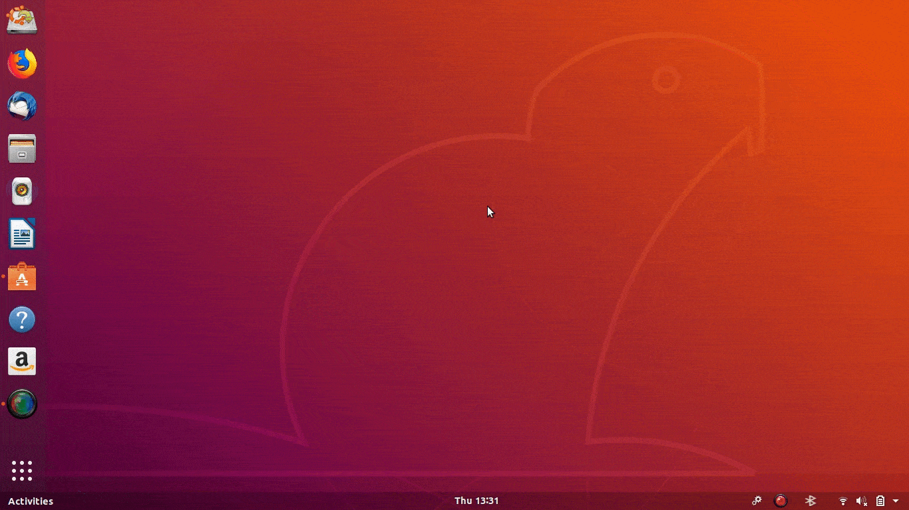

# Gnome shell Extension development

This project uses icons from: https://github.com/GNOME/adwaita-icon-theme
Adwaita icons are the default of Ubuntu.

In the Ubuntu installation the icon can be found: **/usr/share/icons/Adwaita/scalable/actions/system-run-symbolic.svg**


# Example Extension preview



```
ubuntu@ubuntu:~/Desktop$ gnome-shell-extension-tool -c

Name should be a very short (ideally descriptive) string.
Examples are: "Click To Focus",  "Adblock", "Shell Window Shrinker".

Name: Example

Description is a single-sentence explanation of what your extension does.
Examples are: "Make windows visible on click", "Block advertisement popups"
              "Animate windows shrinking on minimize"

Description: Research subject

Uuid is a globally-unique identifier for your extension.
This should be in the format of an email address (foo.bar@extensions.example.com), but
need not be an actual email address, though it's a good idea to base the uuid on your
email address.  For example, if your email address is janedoe@example.com, you might
use an extension title clicktofocus@janedoe.example.com.
Uuid [Example@ubuntu]: example@extensions.gnome.org
Created extension in '/home/ubuntu/.local/share/gnome-shell/extensions/example@extensions.gnome.org'
ubuntu@ubuntu:~/Desktop$ snap-confine has elevated permissions and is not confined but should be. Refusing to continue to avoid permission escalation attacks
```
