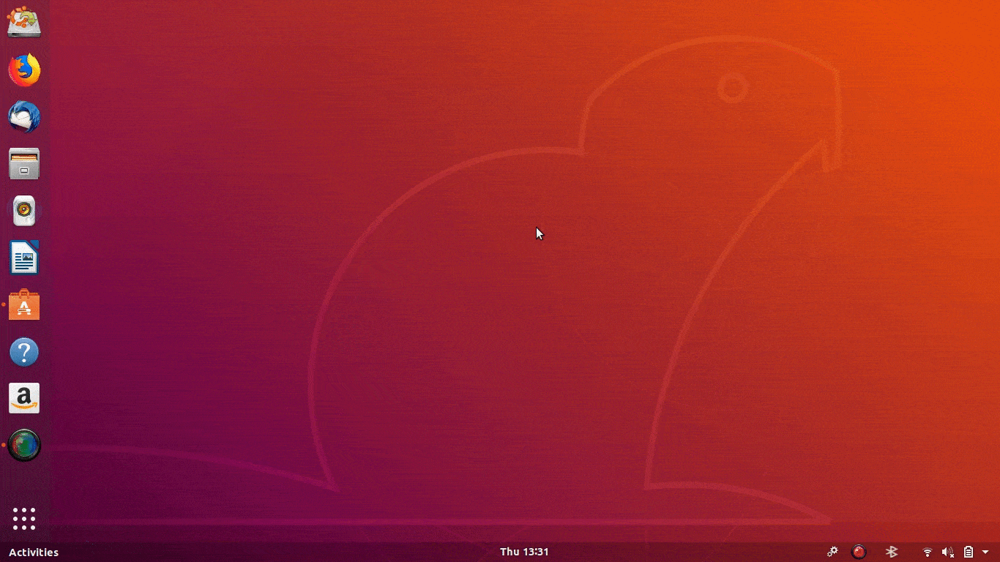

# Gnome shell Extension development


## Extension's description / brief overview
This is Personal Gnome Shell Extension Example's study, it was started to get better understanding about Gnome Extensions.

In the future, the project might use libre office draw program to ease the necessary adjustments, if a need for that arrives.

The only code quality measurement: 
https://www.google.lt/search?q=the+only+valid+measurement+of+code+quality&source=lnms&sa=X&ved=0ahUKEwi794DPiLrdAhXNh6YKHeyIAa4Q_AUICSgA&biw=1920&bih=938&dpr=1

#### Setup Eclipse Integrated Development Environment for Javascript

Eclipse tools:
* https://marketplace.eclipse.org/content/closure-ide
* https://marketplace.eclipse.org/content/jshint-eclipse
* https://marketplace.eclipse.org/content/editbox
* https://marketplace.eclipse.org/content/codemix


## About the icon used in this example (/system-run-symbolic.svg)
Adwaita icons are the default icons of Ubuntu, that's the reason why it is chosen for this example extension.


**The example project uses icon from:** 
* https://github.com/GNOME/adwaita-icon-theme  

**After Ubuntu installation the scalable .svg icon can be found in:**  
* /usr/share/icons/Adwaita/scalable/actions/system-run-symbolic.svg


# Example Extension preview



```
ubuntu@ubuntu:~/Desktop$ gnome-shell-extension-tool -c

Name should be a very short (ideally descriptive) string.
Examples are: "Click To Focus",  "Adblock", "Shell Window Shrinker".

Name: Example

Description is a single-sentence explanation of what your extension does.
Examples are: "Make windows visible on click", "Block advertisement popups"
              "Animate windows shrinking on minimize"

Description: Research subject

Uuid is a globally-unique identifier for your extension.
This should be in the format of an email address (foo.bar@extensions.example.com), but
need not be an actual email address, though it's a good idea to base the uuid on your
email address.  For example, if your email address is janedoe@example.com, you might
use an extension title clicktofocus@janedoe.example.com.
Uuid [Example@ubuntu]: example@extensions.gnome.org
Created extension in '/home/ubuntu/.local/share/gnome-shell/extensions/example@extensions.gnome.org'
ubuntu@ubuntu:~/Desktop$ snap-confine has elevated permissions and is not confined but should be. Refusing to continue to avoid permission escalation attacks
```
